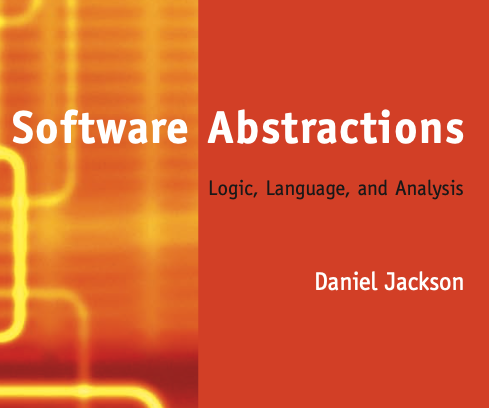

# Software Abstractions

Daniel Jackson

[Book](https://alloytools.org/book.html)

## 3.6 Declarations and Multiplicity Constraints  

### Page 77, "Multiplicities are just a shorthand, and can be replaced by standard constraints."

## 5: Analysis

### Page 139, "Analysis brings software abstractions to life in three ways. First, it encourages you as you explore, by giving you concrete examples that reinforce intuition and suggest new scenarios. Second, it keeps you honest, by helping you to check as you go along that what you write down means what you think it means. And third, it can reveal subtle flaws that you might not have discovered until much later (or not at all)."

## 5.2 Instances, Examples, and Counterexamples

### Page 144, "In the case of an assertion, the analysis constraint is the negation of the assertion’s constraint conjoined with the facts of the model. An instance is a counterexample: a scenario in which the facts hold but the assertion does not."
